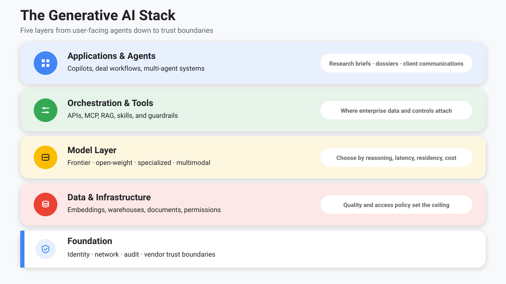
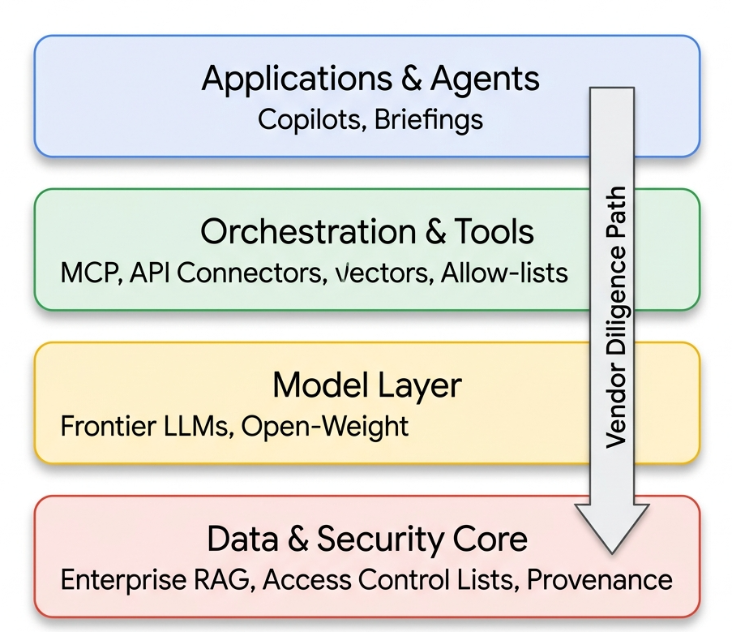
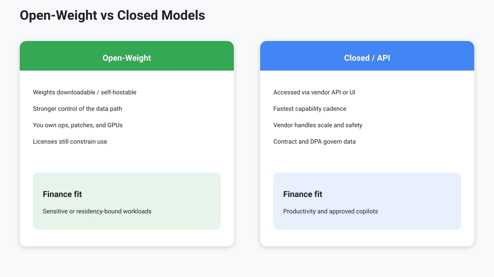
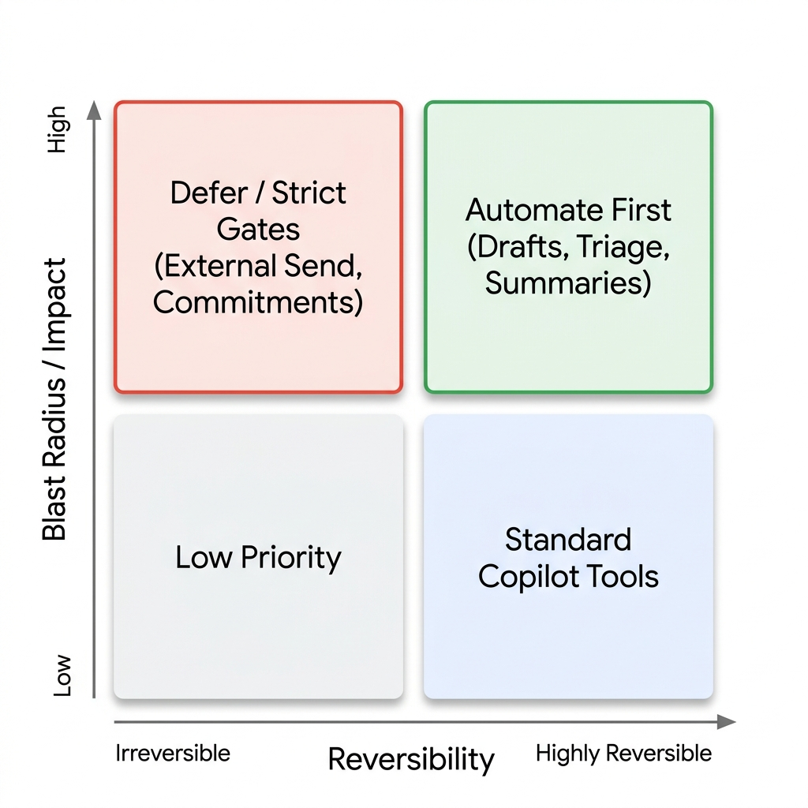
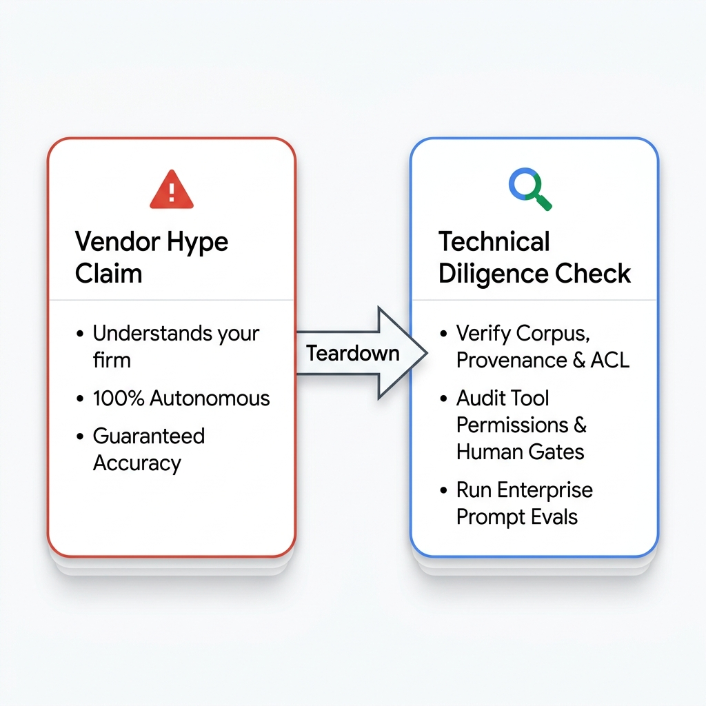

<!-- course-title: Advanced AI Deep-Dive: Rothschild and Co -->
<!-- layout: title -->

Advanced AI Deep-Dive: Rothschild and Co

# Chapter 1: The Modern AI Landscape

---

# Chapter 1: Objectives

- Describe the generative AI stack from applications to foundation
- Compare open-weight and closed models for enterprise fit
- Explain the shift from chatbots to agentic systems
- Separate marketing hype from technical capability claims

---

<!-- layout: navigation -->
# Chapter 1

- **The Generative AI Stack**
- Open Weight vs. Closed Models
- From Chatbots to Agentic Systems
- Separating Hype from Technical Reality

---

<!-- layout: title-image -->
# The Generative AI Stack

---

<!-- layout: 2-column -->
# Name the Layer, Not Just the Brand

### Stack Diligence
- A deal-briefing copilot is an **application**, not "the model"
- Quality depends on **data retrieved** and **tools allowed**
- Model choice is one decision among latency, residency, cost, and evals
- Architecture talks should name each layer explicitly
  - Apps and agents
  - Orchestration and tools
  - Model, data, foundation

> [!IMPORTANT]
> Vendor demos start at the app layer. Diligence must reach data and controls.

---

<!-- layout: 3-column -->
# Capability Types (Roles, Not Brands)

### Chat / generate
- Drafts, Q and A, rewrite
- Needs grounding for facts
- Default productivity surface

### Embeddings / multimodal / reason
- Search and similarity
- Docs, tables, images as input
- Extra compute for hard steps

### Agents
- Goal + tools + loop
- Permission to act
- Blast radius is the product

> [!TIP]
> Buy the **capability** you need. Brand names change; these roles do not.

---

# Landscape Map (Roles, Not Brands)

| Role | What you buy | Watch-outs |
| :--- | :--- | :--- |
| Frontier APIs | Highest reasoning cadence | Contract, DPA, data path |
| Open-weight / self-host | Data-path control | You own ops; uneven catch-up |
| Enterprise surfaces | Tenant grounding and ACL | Draft vs send; SKU opacity |
| Agent platforms | Tools, memory, HITL, evals | Autonomy without allow-lists |

---

<!-- layout: 2-column -->
# Buy Decision: Named Workflows

### Deal-memo triage (read-mostly)
- Prefer **enterprise surface** or Frontier API + RAG
- Need citations, ACL, draft-not-send
- Agent platform is overkill until tools are required

### Client-briefing agent (multi-step)
- Prefer **agent platform** with allow-lists and HITL
- Tools for news, company reports, CRM—not chat alone
- Frontier API as the brain; platform owns the loop

> [!IMPORTANT]
> Match the **workflow shape** to the buy: triage ≠ autonomous client briefing.

---

<!-- layout: navigation -->
# Chapter 1

- The Generative AI Stack
- **Open Weight vs. Closed Models**
- From Chatbots to Agentic Systems
- Separating Hype from Technical Reality

---

<!-- layout: title-image -->
<!-- # Open Weight vs Closed Models -->

---

<!-- layout: 2-column -->
# Decision Criteria

### Capability and cadence
- Closed APIs often lead on frontier reasoning
- Open-weight catches up unevenly by task
- Eval on **your** finance prompts, not leaderboards alone

### Control and operations
- Open-weight: stronger data-path control; you run ops
- Closed: contract, DPA, and tenant controls matter
- Hybrid is common: productivity vs sensitive workloads

---

# What "Open" Does Not Mean

- **Open-weight ≠ free for any use** — licenses still constrain commercial use
- **Self-hosted ≠ automatically safer** — misconfigured access still leaks
- **Closed ≠ unusable when regulated** — enterprise offers may meet residency needs
- Ask: *Where do prompts, documents, and logs live?*

---

<!-- layout: navigation -->
# Chapter 1

- The Generative AI Stack
- Open Weight vs. Closed Models
- **From Chatbots to Agentic Systems**
- Separating Hype from Technical Reality

---

<!-- layout: stacked -->
# From Chatbots to Agentic Systems

- A chatbot answers one prompt at a time — you drive every step
- An agent pursues a goal: plan, act, check, and continue
- The shift is the **loop, tools, and permission to act**

---

<!-- layout: stacked -->
# Autonomy Spectrum (Finance)

| Mode | Example | Human role |
| :--- | :--- | :--- |
| Assist | Draft client email from notes | Edit every word |
| Copilot | Summarize deal-memo sections on demand | Steer each request |
| Agent | Monitor news → flag → draft client briefing | Approve gates |
| Multi-agent | Specialists + orchestrator | Own policy and outcomes |

> [!TIP]
> Buy for the autonomy you can supervise — not the autonomy in the pitch deck.

---

<!-- layout: 2-column -->
# What to Automate First

- Prefer high-feedback, reversible work
  - Drafts, triage, structured extracts
- Defer irreversible or novel judgment
  - External client send, strategy calls
- Score candidates on **blast radius × reversibility**
- Start read-mostly; expand writes only with gates

---

<!-- layout: navigation -->
# Chapter 1

- The Generative AI Stack
- Open Weight vs. Closed Models
- From Chatbots to Agentic Systems
- **Separating Hype from Technical Reality**

---

<!-- layout: 2-column -->
# Hype Patterns to Spot

- **"Understands your firm"** / **"trained on all market data"** 
  — ask corpus, ACL, provenance
- **"Fully autonomous"** / **"guaranteed accuracy"** 
  — ask gates, failure modes, cite-or-refuse

> [!TIP]
> Use the teardown table next—same claims, inspected by stack layer.

---

<!-- layout: stacked -->
# Worked Teardown: Fake Vendor Pitch

**Claim:** "Trained on all market data. Fully autonomous. Guarantees accuracy for Debt Advisor client briefings."

| Claim fragment | Inspect this layer | Better question |
| :--- | :--- | :--- |
| "All market data" | Data | Provenance, licenses, freshness? |
| "Fully autonomous" | Orchestration / controls | Tools, step limits, HITL? |
| "Guarantees accuracy" | Model + grounding | Evals on *your* prompts? Cite-or-refuse? |
| "Understands your firm" | Apps + RAG | What corpus and ACL are connected? |

---

<!-- layout: 3-column -->
# Diligence Questions

### Model
- Task benchmarks?
- Context limits?
- Reasoning mode?

### Data
- What is indexed?
- Who can access?
- Retention policy?

### Control
- Tool permissions?
- Audit logs?
- Human gates?

---

# Face-Off Rubric (What You Will Score)

- **Task fit** — Does it actually do deal-memo triage / client-briefing steps you care about?
- **Grounding / citations** — Sources present, or fluent invention under missing docs?
- **Data path** — Where do prompts, uploads, and logs live?
- **Latency / cost** — Usable in a live deal rhythm, or demo-only depth?
- **Refusal behavior** — Does it abstain when evidence is thin?

---

# Lab 1: Model Face-Off

**Time:** 25 minutes

**Lab guide:** [Lab 1 instructions](labs/lab-01-model-face-off.md)

---

# What You Learned

- Described the generative AI stack from applications to foundation
- Compared open-weight and closed models for enterprise fit
- Explained the shift from chatbots to agentic systems
- Separated marketing hype from technical capability claims

---

# Quiz 1 of 3

**A vendor demos a polished deal copilot that drafts client-briefing sections from a sample deal memo. Where should diligence start?**

- A. Accept the UI—application quality proves the architecture
- B. Ask only which frontier model brand is behind the chat box
- C. Name the stack layers in play—especially data retrieved, tools allowed, and controls
- D. Skip diligence if the demo used open-weight models

---

# Quiz 1 — Answer

**A vendor demos a polished deal copilot that drafts client-briefing sections from a sample deal memo. Where should diligence start?**

**Correct: C.** Name the stack layers in play—especially data retrieved, tools allowed, and controls

- Demos live at the application layer; risk often sits in data, tools, and gates
- Model brand is one decision—not a substitute for corpus, ACL, and refusal behavior
- Use the face-off rubric: task fit, citations, data path, latency/cost, refusal
- Open vs closed does not waive diligence

---

# Quiz 2 of 3

**A vendor claims "fully autonomous banking AI" with no human review. What is the strongest response?**

- A. Agree — frontier models eliminated hallucination
- B. Autonomy is a spectrum; agents amplify blast radius and still need gates
- C. Open-weight models never require review
- D. Autonomy only matters during coding projects

---

# Quiz 2 — Answer

**A vendor claims "fully autonomous banking AI" with no human review. What is the strongest response?**

**Correct: B.** Autonomy is a spectrum; agents amplify blast radius and still need gates

- Chatbots answer one prompt; agents pursue goals with tools and permission to act
- More autonomy without controls increases risk, not just productivity
- Open vs closed is about control and ops — not a substitute for human gates
- Buy for the autonomy level you can supervise

---

<!-- layout: 2-column -->
# Quiz 3 of 3 — Discussion

### Prompt
Pick one Rothschild workflow (research brief, client briefing, or client email draft).

### Discuss
- At which stack layer does most of the risk live?
- Open-weight, closed/API, or hybrid — and why?
- What hype claim would you challenge first with a vendor?

---

<!-- layout: 2-column -->
# Quiz 3 — Discussion Points

**Pick one Rothschild workflow (research brief, client briefing, or client email draft).**

### Strong Answers Mention
- Risk often sits in data access, tools, and controls — not the model brand
- Hybrid is common: productivity suites vs sensitive workloads
- Ask where prompts, docs, and logs live; demand trust-boundary diagrams
- Match autonomy to supervision capacity

### Watch For
- Treating the chatbot UI as "the architecture"
- "Open means automatically safer"
- Accepting "fully autonomous" with no failure modes

---

# Questions and Answers

Questions?
