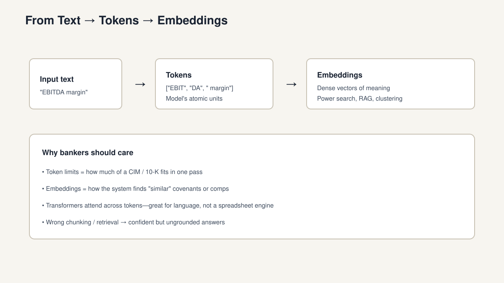
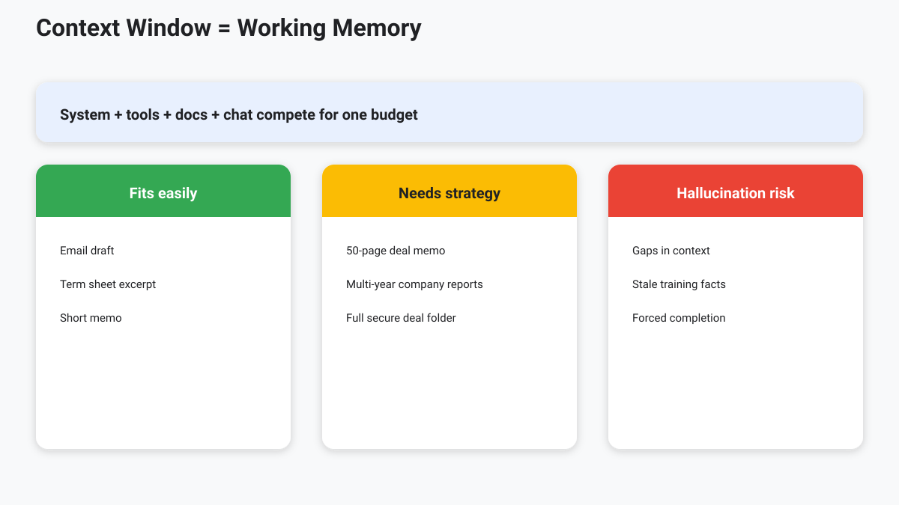

<!-- course-title: Advanced AI Deep-Dive: Rothschild and Co -->
<!-- layout: title -->

Advanced AI Deep-Dive: Rothschild and Co

# Chapter 2: Under the Hood – How Models Actually Work

---

# Chapter 2: Objectives

- Explain transformers, tokens, and embeddings in plain language
- Distinguish training, inference, and fine-tuning
- Relate context windows to hallucination risk
- Describe reasoning models and test-time compute tradeoffs

---

<!-- layout: navigation -->
# Chapter 2

- **Transformers, Tokens, and Embeddings**
- Training vs. Inference and Fine-tuning
- Context Windows and Hallucination
- Reasoning Models and Test-time Compute

---

<!-- layout: title-image -->
# From Text → Tokens → Embeddings

---

<!-- layout: 2-column -->
# Transformers: Strengths and Limits

### Strengths
- Attention across tokens
- Language patterns and synthesis
- Strong at structure and narrative

### Limits
- Not a calculator or ledger
- Not a source of truth alone
- Capability ≠ domain correctness

> [!NOTE]
> “Transformer-based” describes architecture—not guaranteed finance accuracy.

---

<!-- layout: 2-column -->
# Failure Demo: Invented Covenant

### What the banker asked
- “What leverage covenant applies if EBITDA dips 15%?”
- Attached: wrong excerpt (fee schedule only)
- No retrieval from the facility agreement

### What the model did
- Wrote a fluent “Net leverage ≤ 4.0x” answer
- Sounded decisive; cited nothing real
- Optimized to **continue helpfully**, not to abstain

> [!WARNING]
> Fluency under missing context is a feature of next-token prediction—not diligence.

---

# Tokens: The Real Meter

- Models read **tokens**, not pages or words exactly
- Tokenization splits text oddly (`EBITDA` may become multiple tokens)
- Limits apply to **input + output + tool results** in many systems
- Long CIMs, filings, and chat history compete for the same budget

---

<!-- layout: navigation -->
# Chapter 2

- Transformers, Tokens, and Embeddings
- **Training vs. Inference and Fine-tuning**
- Context Windows and Hallucination
- Reasoning Models and Test-time Compute

---

<!-- layout: 3-column -->
# Three Different Activities

### Training
- Learn parameters from huge corpora
- Costly, rare for most firms
- Sets general capability

### Inference
- Run a trained model on a prompt
- What you do every day
- Latency and price matter

### Fine-tuning
- Specialize behavior on your data
- Does not replace permissions
- Narrower than “new intelligence”

---

# Fine-Tuning: Use and Misuse

- **Useful for**: style, formats, domain phrasing, classification heads
- **Not a substitute for**: up-to-date deal data, access control, or RAG
- **Risk**: baking in stale or confidential examples into weights
- Prefer retrieval + tools when facts must stay current and attributable

---

<!-- layout: 3-column -->
# Fine-Tuning Flavors (Buyer Vocab)

### SFT
- Supervised examples
- “Answer like our memos”
- Still not live truth

### Preference / RLHF-style
- Rank better answers
- Tone, safety, format
- Does not add deal facts

### LoRA / adapters
- Smaller, swappable packs
- Easier to rev / rollback
- Same misuse risks apply

> [!TIP]
> If the fact must change next week, do not put it in weights—retrieve or tool-call it.

---

# Embeddings for Finance Search

- Map text to vectors so “similar meaning” is measurable
- Power semantic search over memos, transcripts, and policies
- Quality depends on chunking, metadata, and embedding model choice
- Bad retrieval → fluent answers about the **wrong** document

---

<!-- layout: navigation -->
# Chapter 2

- Transformers, Tokens, and Embeddings
- Training vs. Inference and Fine-tuning
- **Context Windows and Hallucination**
- Reasoning Models and Test-time Compute

---

<!-- layout: title-image -->
# Context Window = Working Memory

---

# Context Packing: Everyone Fights for Budget

| Competing content | Why it burns tokens |
| :--- | :--- |
| System / policy | Firm rules, refusal behavior |
| Retrieved chunks (RAG) | Grounding—if you over-retrieve, noise wins |
| Tool results | API payloads can be huge |
| Chat history | Prior turns crowd out the CIM |
| Your question | Often the smallest piece |

> [!IMPORTANT]
> “We have a 128k context window” is not a strategy. **What you pack**—and in what order—decides quality.

---

# Why Hallucinations Happen

- Models are optimized to **continue** helpfully, not to abstain
- Missing, conflicting, or truncated context invites invention
- Training cutoff ≠ live markets, cap tables, or internal terms
- Long context helps—but “lost in the middle” still occurs

> [!WARNING]
> A confident tone is not evidence. Require sources for material claims.

---

# Grounding Patterns That Work

- **Retrieve then generate** with citations (RAG)
- **Tool calls** for live prices, positions, or system-of-record fields
- **Constrained outputs** (schemas, checklists, quote-from-source)
- **Human review** on client-facing and investment-critical artifacts

---

<!-- layout: navigation -->
# Chapter 2

- Transformers, Tokens, and Embeddings
- Training vs. Inference and Fine-tuning
- Context Windows and Hallucination
- **Reasoning Models and Test-time Compute**

---

# Reasoning Models

- Extra “thinking” tokens before the final answer
- Often stronger on multi-step analysis and careful planning
- Slower and typically more expensive per task
- Still need grounding for proprietary facts

---

<!-- layout: 2-column -->
# Test-Time Compute

### What it means
- Spend more inference compute to improve quality
- Longer chains of thought, search, or self-checks
- A dial: speed/cost vs. depth

### When to use it
- Complex structuring scenarios
- Ambiguous credit narratives
- Multi-document synthesis
- Not for every email rewrite

---

<!-- layout: 2-column -->
# When “More Thinking” Still Fails

### Thinking helps
- Multi-step logic on **given** evidence
- Planning tool use and self-checks
- Careful comparison across passages

### Thinking cannot fix
- Wrong or missing retrieved docs
- Poisoned context / prompt injection
- No access to live system-of-record fields
- A task that needed a calculator or query

> [!WARNING]
> Reasoning models amplify whatever is in context—including confident errors.

---

<!-- layout: stacked -->
# Practical Takeaway

- Vocabulary: tokens, embeddings, context, inference, fine-tune, reasoning
- Architecture choice starts with **task + risk + data freshness**
- Bigger windows and smarter models reduce—but do not eliminate—grounding needs
- Next: tools, MCP, and RAG attach truth to the loop

---

# Lab 2: Grounding AI Answers in Real Data

**Time:** 25 minutes

**Lab guide:** [Lab 2 instructions](labs/lab-02-grounding-answers.md)

---

# What You Learned

- Explained transformers, tokens, and embeddings in plain language
- Distinguished training, inference, and fine-tuning
- Related context windows to hallucination risk
- Described reasoning models and test-time compute tradeoffs

---

# Quiz 1 of 3

**Why should bankers care about tokens when reviewing a 50-page CIM with an LLM?**

- A. Tokens only affect image generation quality
- B. Token limits determine how much input and output fit in one pass
- C. More tokens always guarantee factual accuracy
- D. Tokens replace the need for embeddings and retrieval

---

# Quiz 1 — Answer

**Why should bankers care about tokens when reviewing a 50-page CIM with an LLM?**

**Correct: B.** Token limits determine how much input and output fit in one pass

- Models read tokens, not pages; long CIMs compete with instructions and chat history
- Large documents often need chunking/RAG rather than a single naive paste
- Tokens do not guarantee correctness—grounding still matters
- Embeddings help find relevant passages; they do not remove context limits

---

# Quiz 2 of 3

**Your team wants up-to-date covenant language from internal memos. Which approach is usually best?**

- A. Fine-tune the model weekly on every memo and skip retrieval
- B. Rely on the model’s training cutoff for live deal facts
- C. Retrieve approved documents (RAG) and/or call tools, then generate with citations
- D. Increase temperature so the model “tries harder”

---

# Quiz 2 — Answer

**Your team wants up-to-date covenant language from internal memos. Which approach is usually best?**

**Correct: C.** Retrieve approved documents (RAG) and/or call tools, then generate with citations

- Fine-tuning is for style/behavior specialization—not a live source of truth
- Training cutoff cannot replace proprietary or changing deal data
- Grounding patterns: retrieve-then-generate, tools, constrained outputs, human review
- Temperature does not fix missing context

---

<!-- layout: 2-column -->
# Quiz 3 of 3 — Discussion

### Prompt
You asked a model for leverage capacity and it answered confidently with no sources.

### Discuss
- What likely went wrong in terms of context, retrieval, or incentives?
- When would you spend extra test-time compute (reasoning) vs keep the task fast/cheap?
- What verification steps would you require before the answer reaches a client?

---

<!-- layout: 2-column -->
# Quiz 3 — Discussion Points

**You asked a model for leverage capacity and it answered confidently with no sources.**

### Strong Answers Mention
- Fluent completion ≠ evidence; missing/truncated context invites invention
- Prefer citations, schema constraints, and “say unknown” rules
- Reasoning/test-time compute helps hard multi-step analysis—not every rewrite
- Material claims need grounding + human sign-off

### Watch For
- Trusting tone as proof
- Fine-tuning as a fix for freshness
- Unlimited context assumed to eliminate hallucination

---

# Questions and Answers

Questions?
