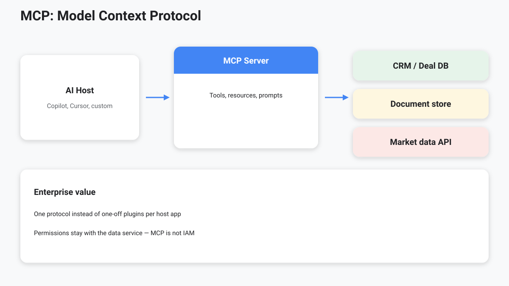
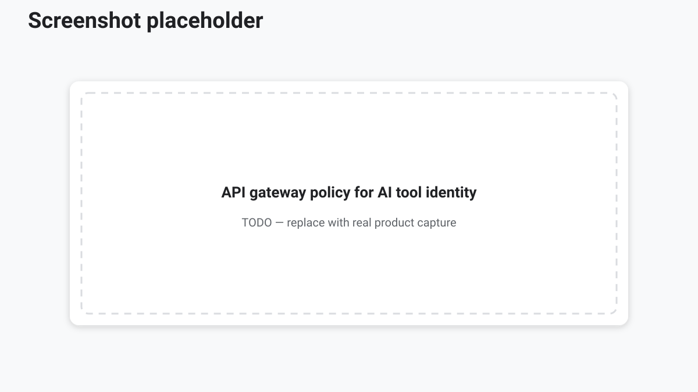

<!-- course-title: Advanced AI Deep-Dive: Rothschild & Co -->
<!-- layout: title -->


Advanced AI Deep-Dive: Rothschild & Co

# Chapter 3: Connecting Agentic Systems to Enterprise Tools and Data

---

# Chapter 3: Objectives

- Explain advanced tool use and function calling
- Describe API patterns for enterprise connectivity
- Position MCP as a standard for enterprise context
- Outline live data connections and custom agent skills

---

<!-- layout: navigation -->
# Chapter 3

- **Advanced Tool Use and Function Calling**
- Using APIs for Enterprise Connectivity
- MCP: The Model Context Protocol
- Connecting to Live Enterprise Data Sources
- Writing Custom Agent Skills

---

<!-- layout: stacked -->
# Tools Turn Language into Action

- Without tools, the model can only produce text
- **Function calling**: model proposes a structured tool call; runtime executes it
- Results return to the model for the next step
- This is the core of agentic behavior

> [!IMPORTANT]
> Every tool is a privilege. Design allow-lists as carefully as you design prompts.

---

# Anatomy of a Tool Call

```json
{
  "name": "get_facility_terms",
  "arguments": {
    "deal_id": "DA-2026-0142",
    "fields": ["covenants", "maturity", "agent_bank"]
  }
}
```

- Name + typed arguments → deterministic system execution
- Model chooses **when**; your platform enforces **whether**

---

<!-- layout: navigation -->
# Chapter 3

- Advanced Tool Use and Function Calling
- **Using APIs for Enterprise Connectivity**
- MCP: The Model Context Protocol
- Connecting to Live Enterprise Data Sources
- Writing Custom Agent Skills

---

# APIs Are the Enterprise Nervous System

- CRM, DMS, market data, HRIS, data warehouse—all speak HTTP/APIs
- Agents should call **approved APIs**, not scrape internal UIs
- Auth: OAuth, service accounts, short-lived tokens, mTLS where required
- Observability: log tool name, actor, resource, and outcome

---

<!-- layout: 2-column -->
# Integration Patterns

### Synchronous
- Request/response in the agent turn
- Good for lookups and validation
- Watch latency budgets

### Asynchronous
- Queue jobs, poll or webhook
- Good for long research packs
- Needs status UX and timeouts

---

# API Design for Agents

- Prefer **narrow, intention-revealing** endpoints over god-queries
- Return machine-readable fields + human labels
- Include stable IDs for citations (`doc_id`, `clause_id`)
- Fail with clear errors the model can recover from—or escalate

---

<!-- layout: navigation -->
# Chapter 3

- Advanced Tool Use and Function Calling
- Using APIs for Enterprise Connectivity
- **MCP: The Model Context Protocol**
- Connecting to Live Enterprise Data Sources
- Writing Custom Agent Skills

---

<!-- layout: title-image -->
# MCP: Model Context Protocol



---

# Why MCP Matters

- Standard way for hosts (IDEs, copilots, agents) to discover **tools** and **resources**
- Reduces one-off plugins for every client application
- Keeps capability definitions close to the data service
- Improves portability across agent runtimes

> [!NOTE]
> MCP is plumbing and product strategy—not a model. It does not replace IAM.

---

# MCP Building Blocks

| Concept | Role |
| :--- | :--- |
| Host | App that runs the agent (e.g., IDE, copilot) |
| Client | Connector inside the host |
| Server | Exposes tools/resources for a domain system |
| Tools | Actions the model may invoke |
| Resources | Readable context (files, records, schemas) |

---

<!-- layout: navigation -->
# Chapter 3

- Advanced Tool Use and Function Calling
- Using APIs for Enterprise Connectivity
- MCP: The Model Context Protocol
- **Connecting to Live Enterprise Data Sources**
- Writing Custom Agent Skills

---

# Live Data: Databases and Beyond

- Pattern: agent → tool/MCP → **service layer** → database
- Avoid giving the model raw SQL superpowers on production
- Use parameterized queries, views, and row-level security
- Separate read paths (research) from write paths (updates)

---

<!-- layout: stacked -->
# Secure Live Connectivity

- Authenticate the **user or service**, not “the LLM”
- Enforce least privilege per tool
- Redact secrets and PII before they enter prompts/logs
- Cache carefully—stale positions and caps are risk events

<!-- TODO IMAGE: Screenshot of an enterprise API gateway policy for an AI tool identity -->


---

<!-- layout: navigation -->
# Chapter 3

- Advanced Tool Use and Function Calling
- Using APIs for Enterprise Connectivity
- MCP: The Model Context Protocol
- Connecting to Live Enterprise Data Sources
- **Writing Custom Agent Skills**

---

# What Is a Skill?

- Packaged instructions + optional scripts/references for a recurring job
- Teaches the agent **how your firm does the work**
- Complements tools: skills guide procedure; tools execute side effects
- Versioned like code: owners, reviews, rollback

---

<!-- layout: 2-column -->
# Skill Design Checklist

### Specify
- Trigger: when should this skill load?
- Inputs/outputs and definition of done
- Examples of good and bad runs

### Constrain
- Allowed tools and forbidden actions
- Escalation path to a human
- Start with one high-value workflow first

---

# Lab 3: Blueprinting a Custom Agent

**Time:** 30 minutes

**Lab guide:** [Lab 3 instructions](labs/lab-03-agent-blueprint.md)

---

# What You Learned

- Explained advanced tool use and function calling
- Described API patterns for enterprise connectivity
- Positioned MCP as a standard for enterprise context
- Outlined live data connections and custom agent skills

---

# Q&A

Questions?
