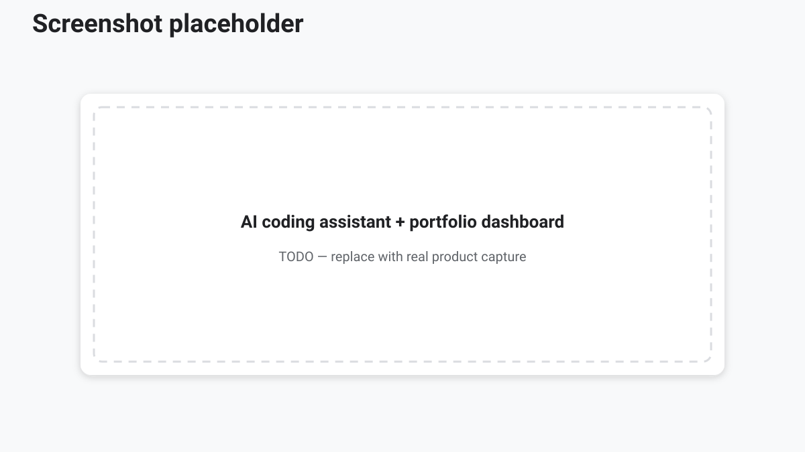

<!-- course-title: Advanced AI Deep-Dive: Rothschild & Co -->
<!-- layout: title -->

Advanced AI Deep-Dive: Rothschild & Co

# Chapter 6: Advanced AI Use Cases

---

# Chapter 6: Objectives

- Structure deep market and competitor research with AI
- Accelerate data analysis and portfolio trend exploration
- Apply vibe coding for dashboards and prototypes safely
- Connect prompts to pitch-ready outputs with human review

---

<!-- layout: navigation -->
# Chapter 6

- **Deep Market and Competitor Research**
- Rapid Data Analysis and Portfolio Trends
- Vibe Coding: Dashboards and Prototypes

---

<!-- layout: stacked -->
# Research Agent Pattern

- Break the question into **sources, angles, and deliverable**
- Separate collection from synthesis (reduce mixed-up citations)
- Prefer primary sources: filings, transcripts, reputable data
- Maintain a running “claims vs. evidence” table

---

<!-- layout: 2-column -->
# Competitor Tear-Sheet Workflow

### AI accelerates
- Landscape mapping
- Theme clustering
- First-draft narratives
- Slide outlines

### Humans own
- Source trust
- Strategic judgment
- Client framing
- Final numbers

---

<!-- layout: stacked -->
# Anti-Patterns in AI Research

- Single-prompt “write a full industry report”
- Accepting vendor blogs as peer to filings
- No distinction between **retrieved** and **recalled** facts
- Skipping contradiction checks across sources

> [!WARNING]
> Speed without source discipline creates elegant misinformation.

---

<!-- layout: navigation -->
# Chapter 6

- Deep Market and Competitor Research
- **Rapid Data Analysis and Portfolio Trends**
- Vibe Coding: Dashboards and Prototypes

---

<!-- layout: 2-column -->
# Analysis Copilot vs. Analytics Platform

### Copilot strengths
- Shape questions
- Explain results
- Draft commentary

### System-of-record strengths
- Authoritative aggregates
- Governed metrics
- Recomputable figures

---

# Portfolio Trends Playbook

1. Define the question and time window
2. Pull data via approved tools or files
3. Profile: missingness, outliers, units
4. Chart candidates; validate joins and filters
5. Draft insight bullets with explicit caveats

> [!TIP]
> Have the model propose hypotheses, then require statistical or SQL evidence.

---

<!-- layout: navigation -->
# Chapter 6

- Deep Market and Competitor Research
- Rapid Data Analysis and Portfolio Trends
- **Vibe Coding: Dashboards and Prototypes**

---

# What Vibe Coding Is

- Iterative natural-language development of small apps/visuals
- Ideal for **internal prototypes**, demos, and exploration
- Not a bypass of engineering standards for production systems
- Works best with clear acceptance checks each iteration

---

<!-- layout: stacked -->
# From Prompt to Dashboard

- Describe audience, metrics, and interactivity constraints
- Generate → run → critique → refine in tight loops
- Pin versions when sharing with stakeholders
- Separate mock data from anything confidential

<!-- TODO IMAGE: Screenshot of an AI coding assistant generating a portfolio dashboard -->

---

<!-- layout: 2-column -->
# Pitch Deck Acceleration

### Method
- Turn verified metrics into a 5-slide spine
- Keep one source table of truth
- Separate speaker notes from slide text

### 5-slide spine
- Situation / ask
- Portfolio snapshot
- Drivers & trends
- Risks & sensitivities
- Recommended next steps

---

# Lab 6: From Prompt to Pitch Deck

**Time:** 30 minutes

**Lab guide:** [Lab 6 instructions](labs/lab-06-prompt-to-pitch.md)

---

# What You Learned

- Structured deep market and competitor research with AI
- Accelerated data analysis and portfolio trend exploration
- Applied vibe coding for dashboards and prototypes safely
- Connected prompts to pitch-ready outputs with human review

---

# Q&A

Questions?
