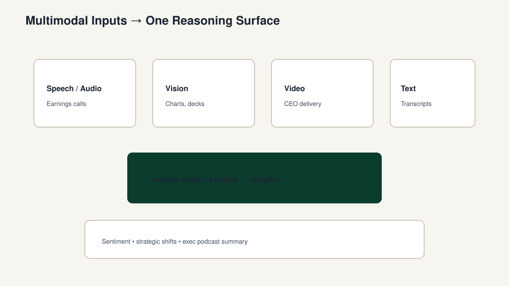

<!-- course-title: Advanced AI Deep-Dive: Rothschild & Co -->
<!-- layout: title -->

Advanced AI Deep-Dive: Rothschild & Co

# Chapter 7: Multi-Modal AI

---

# Chapter 7: Objectives

- Explain how multimodal architectures combine modalities
- Identify speech, vision, and video use cases in finance
- Describe synthesis of multimodal market intelligence
- Outline an earnings-call autopsy workflow with controls

---

<!-- layout: navigation -->
# Chapter 7

- **How Multimodal Architectures Work**
- Speech, Vision, and Video Models in Finance
- Synthesizing Multi-Modal Market Intelligence

---

<!-- layout: title-image -->
# Multimodal Inputs → One Reasoning Surface

---

<!-- layout: stacked -->
# Core Idea

- Multiple input types map into a shared representation space
- The model can attend across text, audio cues, and visual structure
- Pipelines may be **native multimodal** or **composed** (ASR → LLM → TTS)
- Latency, cost, and privacy differ sharply by modality

---

<!-- layout: 2-column -->
# Architecture Choices

### Native multimodal
- One model accepts mixed inputs
- Strong joint reasoning
- Vendor capability varies

### Composed pipeline
- Best-of-breed per step
- Clearer control points
- More integration work

---

# Native vs Composed on an Earnings Call

| Dimension | Native multimodal | Composed (ASR → LLM → TTS) |
| :--- | :--- | :--- |
| Control points | Fewer, opaque | Explicit per stage |
| Swap components | Harder | Easy (better ASR later) |
| Privacy review | One vendor surface | Multiple processors |
| Latency / cost | Often simpler bill | Sum of stages |
| Citation UX | Vendor-dependent | You own timestamps |

---

<!-- layout: navigation -->
# Chapter 7

- How Multimodal Architectures Work
- **Speech, Vision, and Video Models in Finance**
- Synthesizing Multi-Modal Market Intelligence

---

<!-- layout: 3-column -->
# Modalities in Finance

### Speech
- Earnings calls
- Diarization matters
- Sentiment ≠ strategy

### Vision
- Charts and tables
- Scanned PDFs
- Verify key figures

### Video
- Delivery beyond text
- Chunk long runtime
- Watch retention rights

---

<!-- layout: 3-column -->
# Failure Cases by Modality

### Speech fail
- Analyst attributed as CEO
- Bad ASR on ticker/numbers
- Sentiment ≠ guidance change

### Vision fail
- OCR reads 3.0x as 8.0x
- Chart axis mis-scaled
- Table columns shifted

### Video fail
- Slide says X; speech says Y
- Long call, lost middle
- Rights/retention ignored

---

# The Real Analytic Prize: Misalignment

- Slide claims “stable margins”; CEO hedges verbally for two minutes
- Model should **surface the delta**, not average it into one vibe score
- Output: claim ledger rows with timestamp + slide reference + filing cross-check
- Human judges whether it is noise, messaging, or a real shift

---

# Rights, Privacy, and Retention

- Multimodal artifacts often include personal data and third-party content
- Confirm recording rights, retention, and sharing policy before analysis

> [!CAUTION]
> Multimodal artifacts can contain personal data and third-party copyrighted content—confirm rights and retention.

---

# Hard Rules: What Not to Upload

- Client-confidential recordings without clearance
- Unlicensed third-party video/audio
- Personal data not needed for the analytic goal
- Anything your retention policy cannot store

---

<!-- layout: navigation -->
# Chapter 7

- How Multimodal Architectures Work
- Speech, Vision, and Video Models in Finance
- **Synthesizing Multi-Modal Market Intelligence**

---

<!-- layout: stacked -->
# Fusion Workflow

1. Ingest media under access policy
2. Transcribe / extract with timestamps
3. Align transcript to slides or exhibits
4. Retrieve related filings for grounding
5. Synthesize: themes, deltas, risks, quotes
6. Produce text brief + optional audio summary

---

# Earnings Call Autopsy — Outputs

| Artifact | Purpose |
| :--- | :--- |
| Theme map | Strategy shifts vs. prior call |
| Sentiment track | Tone by segment (with caveats) |
| Claim ledger | Claim → quote → timestamp |
| Risk flags | Guidance language, hedges |
| Exec podcast | TTS summary for commute review |

---

# Sample Claim Ledger Row

| Field | Example |
| :--- | :--- |
| Claim | “No change to leverage target” |
| Quote | “We remain comfortable with our stated range” |
| Timestamp | 00:24:12 (CEO) |
| Slide ref | Deck p.7 “Leverage outlook” |
| Filing cross-check | Matches Q2 release leverage range |
| Status | Supported — monitor hedges in the call questions and answers |

---

<!-- layout: 2-column -->
# Quality Bars

### Evidence
- Timestamped citations
- Cross-check guidance figures
- Claim ledger before narrative

### Judgment
- Observation ≠ inference
- Human sign-off required
- Client-ready only after review

---

# Lab 7: Earnings Call Autopsy

**Time:** 30 minutes

**Lab guide:** [Lab 7 instructions](labs/lab-07-earnings-call-autopsy.md)

---

# What You Learned

- Explained how multimodal architectures combine modalities
- Identified speech, vision, and video use cases in finance
- Described synthesis of multimodal market intelligence
- Outlined an earnings-call autopsy workflow with controls

---

# Quiz 1 of 3

**What is the core idea behind multimodal AI architectures?**

- A. Only text models can participate in finance workflows
- B. Multiple input types map into a shared representation for joint reasoning (native or composed pipelines)
- C. Video models eliminate the need for transcripts and citations
- D. Multimodal systems remove privacy and retention concerns

---

# Quiz 1 — Answer

**What is the core idea behind multimodal AI architectures?**

**Correct: B.** Multiple input types map into a shared representation for joint reasoning (native or composed pipelines)

- Native multimodal vs composed (e.g., ASR → LLM → TTS) are both valid
- Latency, cost, and privacy differ by modality
- Transcripts and citations still matter for verifiable claims
- Rights and retention must be confirmed for audio/video artifacts

---

# Quiz 2 of 3

**In an earnings-call autopsy, which practice is mandatory for material claims?**

- A. Treat sentiment scores as proof of a strategic pivot
- B. Timestamped citations, observation vs inference separation, and cross-check of guidance figures
- C. Discard the published release once video analysis finishes
- D. Auto-send the TTS podcast to clients without review

---

# Quiz 2 — Answer

**In an earnings-call autopsy, which practice is mandatory for material claims?**

**Correct: B.** Timestamped citations, observation vs inference separation, and cross-check of guidance figures

- Prosody/sentiment are signals—not proof of strategy
- Claim ledgers and human sign-off precede client or investment use
- Align transcript to slides/exhibits; ground with related filings
- Retention and copyright/rights still apply

---

<!-- layout: 2-column -->
# Quiz 3 of 3 — Discussion

### Prompt
Design an earnings-call autopsy for a coverage team.

### Discuss
- Native multimodal vs composed pipeline—what would you choose and why?
- Which outputs (theme map, claim ledger, podcast) need the strictest gates?
- What personal-data or rights issues must Legal/Compliance clear first?

---

<!-- layout: 2-column -->
# Quiz 3 — Discussion Points

**Design an earnings-call autopsy for a coverage team.**

### Strong Answers Mention
- Composed pipelines offer clearer control points; native may simplify joint reasoning
- Claim ledger and client-facing podcast need strict review; internal theme maps less so
- Confirm recording rights, retention, and sharing before ingest
- Cross-check guidance with the published release

### Watch For
- Equating tone shifts with certain strategic pivots
- Skipping timestamps/citations
- Storing sensitive media without a retention policy

---

# Questions and Answers

