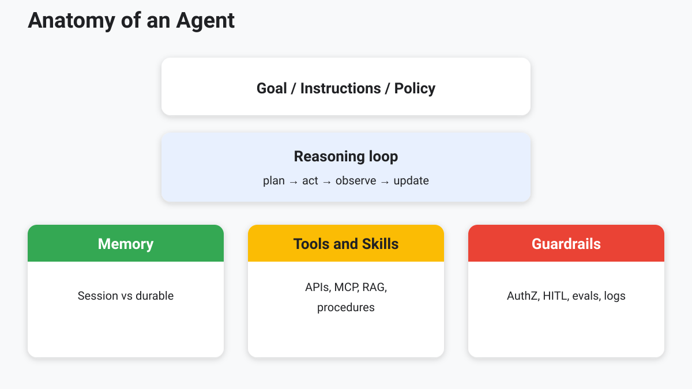
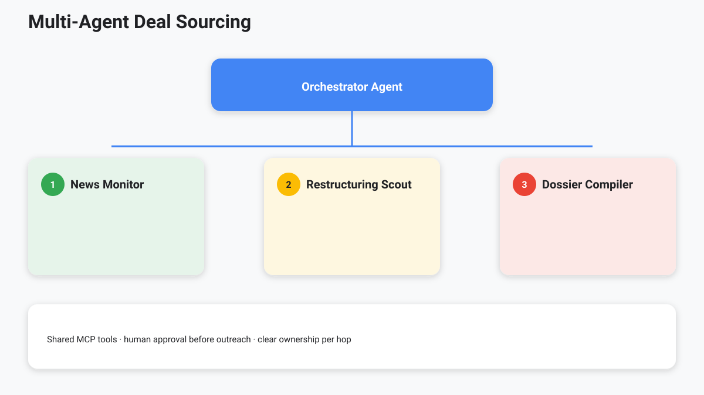

<!-- course-title: Advanced AI Deep-Dive: Rothschild & Co -->
<!-- layout: title -->

Advanced AI Deep-Dive: Rothschild & Co

# Chapter 8: Agentic AI – Setup and Orchestration

---

# Chapter 8: Objectives

- Describe the anatomy of an AI agent
- Configure goals, tools, memory, and policies deliberately
- Compare orchestration and multi-agent (A2A) patterns
- Anticipate failure modes and design human-in-the-loop controls

---

<!-- layout: navigation -->
# Chapter 8

- **Anatomy of an Agent**
- Agent Setup and Configuration
- Orchestration and Multi-Agent (A2A) Patterns
- Failure Modes and Human-in-the-Loop

---

<!-- layout: title-image -->
# Anatomy of an Agent

---

<!-- layout: stacked -->
# Five Parts You Must Name

- **Goal / instructions / policy** — what “good” means and what is forbidden
- **Reasoning loop** — plan → act → observe → update
- **Memory** — session vs. durable institutional context
- **Tools & skills** — capabilities and procedures
- **Guardrails** — authZ, HITL, evals, logging

---

<!-- layout: navigation -->
# Chapter 8

- Anatomy of an Agent
- **Agent Setup and Configuration**
- Orchestration and Multi-Agent (A2A) Patterns
- Failure Modes and Human-in-the-Loop

---

# Configuration Levers

| Lever | Questions |
| :--- | :--- |
| Model | Speed vs. reasoning depth? |
| Temperature / decoding | Creative draft vs. precise extract? |
| Tool allow-list | Minimum viable actions? |
| Knowledge | RAG corpora + live APIs? |
| Memory | What persists across sessions? |
| Limits | Max steps, spend, runtime? |

---

<!-- layout: stacked -->
# Setup Checklist (Debt Advisory Example)

- Mission: monitor → flag restructuring signals → draft dossier
- Inputs: news MCP, filings RAG, internal CRM read tool
- Outputs: structured dossier + source list
- Non-goals: no client outreach, no trading instructions
- Approver: coverage banker before distribution

> [!IMPORTANT]
> Write non-goals. Agents expand to fill ambiguity.

---

# One-Page Agent Spec (Reuse Monday)

| Field | Example fill |
| :--- | :--- |
| Mission | Monitor → score restructuring signals → draft dossier |
| Inputs | News MCP, filings RAG, CRM read (deal-scoped) |
| Outputs | Structured dossier + source list + confidence |
| Tools allowed | search_news, get_filing_chunk, get_crm_account |
| Tools forbidden | send_email, update_crm, any write |
| Non-goals | No client outreach; no trading instructions |
| Memory | Session only; no cross-deal durable memory |
| HITL | Coverage banker before any distribution |
| Evals | Citation present; no cross-deal IDs; step budget ≤ N |
| Kill switch | Max steps / max spend / operator abort |

---

<!-- layout: 2-column -->
# Memory: Useful and Dangerous

### Use carefully
- Session thread for the current task
- Explicit “remember this preference” with scope
- Deal-scoped scratchpads that expire

### Hard risks
- Durable memory leaking across clients/deals
- Stale “facts” treated as policy
- Hidden state reviewers cannot audit

> [!CAUTION]
> If memory can recall Client A while working Client B, you have a confidentiality incident waiting.

---

<!-- layout: navigation -->
# Chapter 8

- Anatomy of an Agent
- Agent Setup and Configuration
- **Orchestration and Multi-Agent (A2A) Patterns**
- Failure Modes and Human-in-the-Loop

---

<!-- layout: title-image -->
# Multi-Agent (A2A) Patterns

---

<!-- layout: 3-column -->
# Common Topologies

### Single agent
- One loop, many tools
- Simpler ops
- Can get overloaded

### Supervisor
- Orchestrator delegates
- Clear specialization
- Needs handoff contracts

### Peer / swarm
- Agents collaborate
- Flexible, harder to audit
- Use sparingly

---

<!-- layout: 2-column -->
# When *Not* to Go Multi-Agent

### Prefer single agent + tools when
- One workflow, one artifact
- Debugging must stay simple
- Latency/cost budgets are tight
- One owner can define policy

### Split agents when
- Clear specialist skills differ
- Handoff artifacts are explicit
- You can afford tracing + evals
- Failure isolation matters

---

# A2A Interoperability vs Today’s Reality

- **Supervisor patterns** (orchestrator + specialists) are what most firms can ship now
- **Agent-to-agent protocols** aim for portable handoffs across vendors/runtimes—still maturing
- Design for **explicit artifacts + trace IDs** regardless of protocol branding
- Do not buy “A2A” as a substitute for allow-lists, HITL, and evals

---

# Handoff Contracts

- Explicit artifacts between agents (JSON/markdown schemas)
- Ownership of each stage (who can mark “ready for human”)
- Shared tracing IDs across tool calls
- Stop conditions when confidence or data quality is low

---

<!-- layout: navigation -->
# Chapter 8

- Anatomy of an Agent
- Agent Setup and Configuration
- Orchestration and Multi-Agent (A2A) Patterns
- **Failure Modes and Human-in-the-Loop**

---

<!-- layout: stacked -->
# Failure Modes to Design For

- **Looping** — retries without new information
- **Tool misuse** — wrong API, wrong deal_id
- **Prompt injection** — malicious content in retrieved docs
- **Silent omission** — skipped sources that change the view
- **Overconfidence** — polished dossiers with thin evidence

---

# Failure → Control Pairings

| Failure mode | Control |
| :--- | :--- |
| Looping | Step budget, kill switch, “no new evidence → stop” |
| Tool misuse | Narrow tools, typed IDs, dry-run / read-only defaults |
| Prompt injection | Instruction hierarchy; treat docs as untrusted |
| Silent omission | Required source checklist; coverage evals |
| Overconfidence | Cite-or-refuse; human gate on thin evidence |

---

<!-- layout: 2-column -->
# Human-in-the-Loop Patterns

### Gates
- Approve tool classes (send, write)
- Approve external publish
- Approve high-risk retrieval scopes

### Oversight
- Sampling & eval sets
- Escalation on low confidence
- Post-hoc audit reviews

---

<!-- layout: stacked -->
# Practical Control Board

- Step budget and kill switch
- Dual control for anything client-visible
- Immutable logs for model, tools, and retrieved chunks
- Rollback: pin skill/model versions that misbehaved

---

<!-- layout: 3-column -->
# Eval Agents—Not Just Answers

### Final answer
- Groundedness / citations
- Policy compliance
- Client-ready tone

### Trajectory
- Right tools called?
- Wrong deal_id?
- Steps within budget?

### Regression pack
- Golden dossiers
- Injection docs
- Cross-deal leakage cases

---

# Lab 8: Designing a Deal-Sourcing Agent

**Time:** 30 minutes

**Lab guide:** [Lab 8 instructions](labs/lab-08-deal-sourcing-agent.md)

---

# What You Learned

- Described the anatomy of an AI agent
- Configured goals, tools, memory, and policies deliberately
- Compared orchestration and multi-agent (A2A) patterns
- Anticipated failure modes and designed human-in-the-loop controls

---

# Quiz 1 of 3

**Which set best captures the anatomy of an agent?**

- A. UI theme, font size, and color palette only
- B. Goal/policy, reasoning loop, memory, tools/skills, and guardrails
- C. A single prompt with no tools and no stop conditions
- D. Unlimited credentials plus a larger context window

---

# Quiz 1 — Answer

**Which set best captures the anatomy of an agent?**

**Correct: B.** Goal/policy, reasoning loop, memory, tools/skills, and guardrails

- Name all five parts or the system invents the missing ones
- Configuration levers: model, decoding, allow-lists, knowledge, memory, step/spend limits
- Write non-goals; agents expand to fill ambiguity
- Guardrails include AuthZ, HITL, evals, and logging

---

# Quiz 2 of 3

**For a multi-agent deal-sourcing system, which failure mode design is most important?**

- A. Remove all human gates to maximize throughput
- B. Ignore prompt injection because retrieval is internal
- C. Plan for looping, tool misuse, injection, silent omission, and overconfidence—with HITL gates
- D. Give every agent identical broad write permissions

---

# Quiz 2 — Answer

**For a multi-agent deal-sourcing system, which failure mode design is most important?**

**Correct: C.** Plan for looping, tool misuse, injection, silent omission, and overconfidence—with HITL gates

- Supervisor topologies need handoff contracts and shared trace IDs
- Approve high-risk tool classes and external publish
- Step budgets, kill switches, immutable logs, version pin/rollback
- No client outreach without coverage banker approval in the Debt Advisory example

---

<!-- layout: 2-column -->
# Quiz 3 of 3 — Discussion

### Prompt
Design a multi-agent system that monitors news, flags restructuring opportunities, and drafts dossiers.

### Discuss
- What is each agent’s role, tools, and MCP/data connections?
- What artifact schema do you pass between agents?
- Where must a human approve—and what are hard non-goals?

---

<!-- layout: 2-column -->
# Quiz 3 — Discussion Points

**Design a multi-agent system that monitors news, flags restructuring opportunities, and drafts dossiers.**

### Strong Answers Mention
- Orchestrator + specialists (monitor, scout, compiler) with clear ownership
- Explicit JSON/markdown handoffs; stop on low confidence/data quality
- Read-mostly tools; no outreach/trading instructions as non-goals
- Dual control for client-visible outputs; full audit trail

### Watch For
- Swarm designs with no audit story
- Unbounded steps/spend
- Polished dossiers with thin evidence and no gate

---

# Questions and Answers

